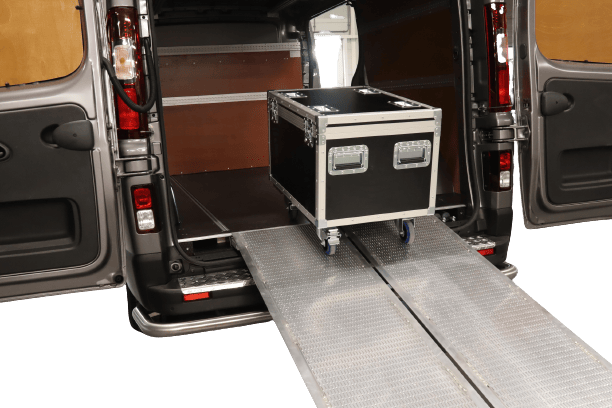

# Context

Rentman is an operations management platform for the event and rental industry. Companies use Rentman to plan projects, schedule equipment and crew, and handle their financial workflow - from quoting to invoicing.

Equipment needs to be physically delivered to the venue before an event and picked up afterward. Event equipment can be heavy and bulky - a single project might include flight cases, speaker stacks, lighting trusses, and staging elements that together weigh several tons. Vehicles have weight and volume limits, so fitting everything safely is a real constraint. Currently, transport is managed outside of Rentman - planners use spreadsheets, whiteboards, or verbal agreements to coordinate which vehicle goes where, who drives, and when. This leads to miscommunication: the wrong truck shows up, gear arrives late, or a vehicle is overloaded because nobody checked the total weight.

Planners want to manage transport directly within the project so everything is in one place.

# User story

**As a** project planner,

**I want to** add transport details (vehicle, driver, departure time) to a project,

**So that** the delivery logistics are planned alongside the rest of the project.

# Acceptance criteria

- The planner can add one or more transport entries to a project

- Each transport entry includes: vehicle, driver, departure time, and destination (venue)

- Vehicles and drivers are selectable from existing records in the system

- The transport section is visible on the project module

- Equipment can be assigned to a vehicle

- Equipment weight should not exceed vehicle load weight

**Designs:** https://www.figma.com/design/oyErs1Ak2m7BbBSFW0OGYA/FE-assessment-materials?node-id=0-1&m=dev&t=P9CWhnN3DOduffCB-1
